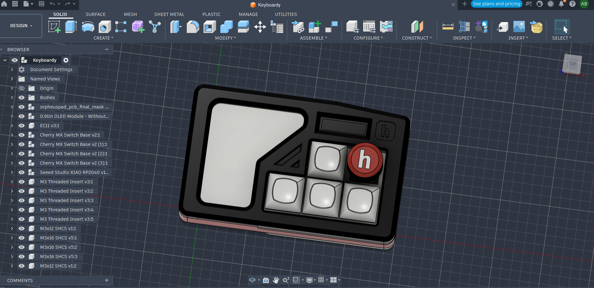

# Keyboardy

A 4-key macropad with a rotary encoder and RGB LEDs, built for the [Hackpad YSWS](https://hackpad.hackclub.com/).

Based on the example macropad from the official [hackclub/hackpad](https://github.com/hackclub/hackpad) repository.

## Features
- 4x Cherry MX switches
- 1x EC11 rotary encoder
- 2x WS2812B RGB LEDs
- Seeed XIAO controller
- OLED header

## Contents
- [PCB/Keyboardy.kicad_sch](PCB/Keyboardy.kicad_sch) — schematic
- [PCB/Keyboardy.kicad_pcb](PCB/Keyboardy.kicad_pcb) — board layout
- [CAD/Keyboardy-Case.step](CAD/Keyboardy-Case.step) — full case assembly
- [Firmware/KMK/main.py](Firmware/KMK/main.py) — KMK firmware
- [production/gerbers.zip](production/gerbers.zip) — PCB production files
- [Keyboardy.csv](Keyboardy.csv) — component BOM
- [libraries/](libraries/) — footprints used by the project
- [kicad_care_package/](kicad_care_package/) — XIAO and SK6812 symbols + footprints

## BOM

| Reference | Value | Footprint | Qty |
|-----------|-------|-----------|-----|
| D1–D4, D9 | 1N4148 DO-35 diode | Diode_THT:D_DO-35_SOD27_P7.62mm_Horizontal | 5 |
| D5, D6 | WS2812B | LED_SMD:LED_WS2812B_PLCC4_5.0x5.0mm_P3.2mm | 2 |
| J1 | OLED display header | Connector_PinHeader_2.54mm:PinHeader_1x04_P2.54mm_Vertical | 1 |
| SW1 | EC11 rotary encoder | Rotary_Encoder:RotaryEncoder_Alps_EC11E-Switch_Vertical_H20mm | 1 |
| SW2–SW5 | Cherry MX switch | MX_Solderable:MX-Solderable-1U | 4 |
| U1 | Seeed Studio XIAO RP2040 | XIAO-Generic-Hybrid-14P-2.54-21X17.8MM | 1 |

Also needed: 4x DSA keycaps, 1x 0.91" 128x32 OLED, 5x M3 heatset inserts + bolts, 3D printed case + 2 acrylic plates.

## Schematic

## PCB

## CAD

## Credits

This project is based on the example macropad from the official [hackclub/hackpad](https://github.com/hackclub/hackpad) repository. The PCB layout, CAD design, and reference firmware from that repo were a huge help in building Keyboardy.

Huge thank you to Hack Club and everyone behind the [Hackpad YSWS](https://hackpad.hackclub.com/) for the parts, the guides, and the whole program — genuinely could not have built this without them. 🧡
