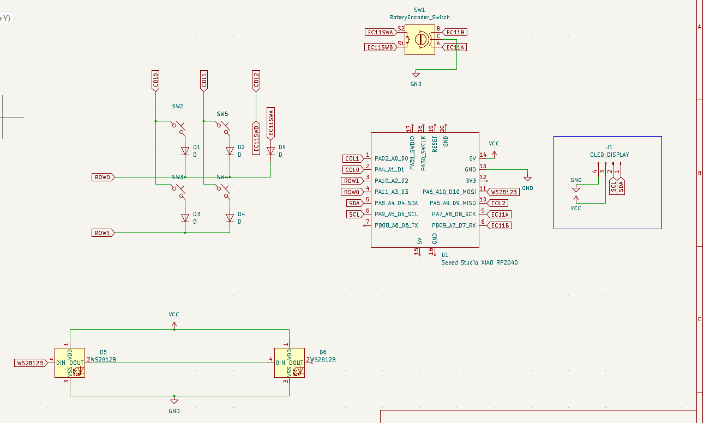
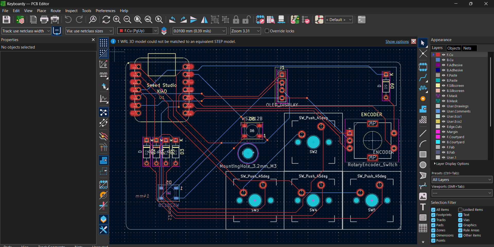

# Keyboardy

A 4-key macropad with a rotary encoder and RGB LEDs, built for the [Hackpad YSWS](https://hackpad.hackclub.com/).

## Features
- 4x Cherry MX switches
- 1x EC11 rotary encoder
- 2x WS2812B RGB LEDs
- Seeed XIAO controller
- OLED header

## Contents
- `Keyboardy.kicad_sch` / `Keyboardy.kicad_pcb` — KiCad schematic and board
- `Keyboardy_CAD/` — case models and board STEP export
- `libraries/` — footprints used by the project

## Photos
Schematic

PCB

CAD

## Credits

This project is based on the example macropad from the official [hackclub/hackpad](https://github.com/hackclub/hackpad) repository. The PCB layout, CAD design, and reference firmware from that repo were a huge help in building Keyboardy.

Huge thank you to Hack Club and everyone behind the [Hackpad YSWS](https://hackpad.hackclub.com/) for the parts, the guides, and the whole program — genuinely could not have built this without them. 🧡

## Parts
- 4x Cherry MX switches
- 4x DSA keycaps
- 5x 1N4148 DO-35 diodes
- 2x WS2812B LEDs
- 1x EC11 rotary encoder
- 1x Seeed XIAO
- 1x 0.91" 128x32 OLED
- 5x M3 heatset inserts + bolts
